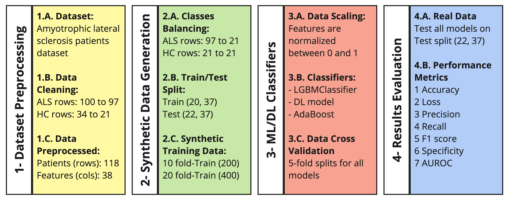

Amyotrophic lateral sclerosis (ALS) Processing
==============================================

This repository contains the implementation of our study titled **"Comparing Machine Learning and Deep Learning Approaches for ALS Diagnosis Using Blood-Derived Biomarkers and Synthetic Data"**.



## Authors

- **Ali Salman** - Department of Medical Biotechnologies, University of Siena, Italy
- **Matteo Leoncini** - Department of Medical Biotechnologies, University of Siena, Italy
- **Elena Niccolai** - Department of Clinical and Experimental Medicine, University of Florence, Florence, Italy
- **Jessica Mandrioli** - Neurology Unit, Department of Neuroscience - Azienda Ospedaliero Universitaria Di Modena, Modena, Italy
- **Amedeo Amedei** - Department of Clinical and Experimental Medicine, University of Florence, Florence, Italy
- **Ernesto Iadanza** - Department of Medical Biotechnologies, University of Siena, Italy

## Abstract

Amyotrophic lateral sclerosis (ALS) is a relentlessly progressive neurodegenerative disease characterized by the loss of upper and lower motor neurons. Recent advances suggest that blood‐derived biomarkers (BDBs) could enable earlier diagnosis and objective monitoring of disease progression. In this work, we assess the ability of both classical machine learning and deep neural networks to distinguish ALS patients from healthy controls (HC) using BDB measurements. To overcome the twin obstacles of small sample size and class imbalance in clinical datasets, we synthetically expanded our data by generating two balanced cohorts: one ten‑fold and one twenty‑fold larger than half of the original dataset. Models were trained exclusively on these synthetic cohorts and then tested on the remaining 50% of the real data (22 records). Remarkably, the network trained on the ten‑fold synthetic set achieved perfect performance, 100% accuracy, F1-score, precision, recall, specificity, and AUROC, on this unseen test set. These findings demonstrate that carefully generated synthetic data can powerfully augment limited clinical datasets and pave the way for robust, blood‐based computational diagnostics in ALS.

## Citation

If you use this work, please cite it as:

```bibtex
@misc{salman2025als_ml_dl,
  author       = {Ali Salman and Matteo Leoncini and Elena Niccolai and Jessica Mandrioli and Amedeo Amedei and Ernesto Iadanza},
  title        = {Comparing Machine Learning and Deep Learning Approaches for ALS Diagnosis Using Blood-Derived Biomarkers and Synthetic Data},
  year         = {2025},
  institution  = {Department of Medical Biotechnologies - University of Siena, Siena, Italy},
  note         = {Available on GitHub: https://github.com/alexsalman/GNB2025},
  url          = {https://github.com/alexsalman/GNB2025},
  urldate      = {2025-04-18}
}

