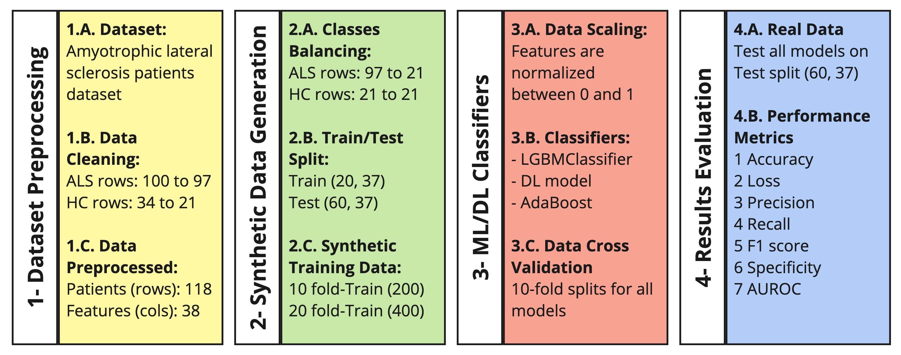

Amyotrophic lateral sclerosis (ALS) Processing
==============================

Please, use the below biblatex to cite this work!

@misc{salman2025als_ml_dl,
  author       = {Ali Salman and Matteo Leoncini and Ernesto Iadanza},
  title        = {Comparing Machine Learning and Deep Learning Approaches for ALS Diagnosis Using Blood-Derived Biomarkers and Synthetic Data},
  year         = {2025},
  institution  = {Department of Medical Biotechnologies - University of Siena, Siena, Italy},
  note         = {Available on GitHub},
  url          = {https://github.com/alexsalman/GNB2025},
  urldate      = {2025-01-17}
}
